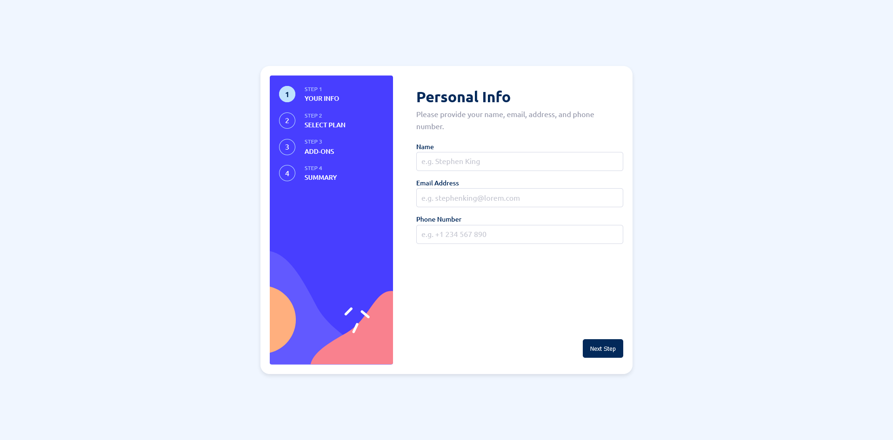

# Frontend Mentor - Multi-step form solution

This is a solution to the [Multi-step form challenge on Frontend Mentor](https://www.frontendmentor.io/challenges/multistep-form-YVAnSdqQBJ). Frontend Mentor challenges help you improve your coding skills by building realistic projects. 

## Table of contents

- [Overview](#overview)
  - [The challenge](#the-challenge)
  - [Screenshot](#screenshot)
  - [Links](#links)
- [My process](#my-process)
  - [Built with](#built-with)
  - [What I learned](#what-i-learned)
  - [Continued development](#continued-development)
  - [Useful resources](#useful-resources)
- [Running the Code](#running-the-code)
- [Author](#author)

**Note: Delete this note and update the table of contents based on what sections you keep.**

## Overview
### The challenge

Users should be able to:

- Complete each step of the sequence
- Go back to a previous step to update their selections
- See a summary of their selections on the final step and confirm their order
- View the optimal layout for the interface depending on their device's screen size
- See hover and focus states for all interactive elements on the page
- Receive form validation messages if:
  - A field has been missed
  - The email address is not formatted correctly
  - A step is submitted, but no selection has been made

### Screenshot



### Links

- Solution URL: [Add solution URL here](TBD)
- Live Site URL: [Add live site URL here](TBD)

## My process

### Built with

- [Vue](https://vuejs.org/) - JS library
- Typescript
- Pinia - State management
- Vuelidate and yup - Validation
- Mobile-first workflow
- CSS custom properties
- Flexbox
- CSS Grid

**Note: These are just examples. Delete this note and replace the list above with your own choices**

### What I learned
During this challenged, I had the opportunity to work with Vue 3 and Pinia for the first time. I found them to be more enjoyable and intuitive to use compared to Vue 2 and Vuex. I also gained a better understanding of TypeScript generics and learned how to use the extends keyword as a condition.

One of the challenges I faced during this challenged was adding a type to the value parameter based on the name parameter. With the help of ChatGPT, I was able to use TypeScript generics and extends to create a UpdatePlanValue type that allowed me to accomplish this:

```ts
  type UpdatePlanValue<T> = T extends 'billing' ? Billing : T extends 'amount' ? IAmount : string;
  const updatePlan = <T extends PlanProperties>(value: UpdatePlanValue<T>, name: T) => {
    form.plan[name] = value;
    return form.plan[name];
  }
```

Overall, this challenged helped me solidify my understanding of TypeScript, Vue 3, and state management with Pinia. In future projects, I plan to continue focusing on improving my skills in these areas.


### Useful resources

- (https://www.youtube.com/watch?v=nViEqpgwxHE and https://www.youtube.com/watch?v=dLPgQRbVquo) - This videos helped me to understand typescript.
- (https://chat.openai.com/chat) - ChatGPT help me generate and understand code that I am not very familiar with!


### Running the code
## Recommended IDE Setup

[VSCode](https://code.visualstudio.com/) + [Volar](https://marketplace.visualstudio.com/items?itemName=Vue.volar) (and disable Vetur) + [TypeScript Vue Plugin (Volar)](https://marketplace.visualstudio.com/items?itemName=Vue.vscode-typescript-vue-plugin).

## Type Support for `.vue` Imports in TS

TypeScript cannot handle type information for `.vue` imports by default, so we replace the `tsc` CLI with `vue-tsc` for type checking. In editors, we need [TypeScript Vue Plugin (Volar)](https://marketplace.visualstudio.com/items?itemName=Vue.vscode-typescript-vue-plugin) to make the TypeScript language service aware of `.vue` types.

If the standalone TypeScript plugin doesn't feel fast enough to you, Volar has also implemented a [Take Over Mode](https://github.com/johnsoncodehk/volar/discussions/471#discussioncomment-1361669) that is more performant. You can enable it by the following steps:

1. Disable the built-in TypeScript Extension
    1) Run `Extensions: Show Built-in Extensions` from VSCode's command palette
    2) Find `TypeScript and JavaScript Language Features`, right click and select `Disable (Workspace)`
2. Reload the VSCode window by running `Developer: Reload Window` from the command palette.

## Customize configuration

See [Vite Configuration Reference](https://vitejs.dev/config/).

## Project Setup

```sh
npm install
```

### Compile and Hot-Reload for Development

```sh
npm run dev
```

### Type-Check, Compile and Minify for Production

```sh
npm run build
```

### Lint with [ESLint](https://eslint.org/)

```sh
npm run lint
```

## Author

- Website - [Lloyd John Landeza](https://lloydjohncodes.netlify.com/)
- Frontend Mentor - [@lloydjohnlandeza](  )
- Linkedin - [Lloyd John Landeza](https://www.linkedin.com/in/lloydjohnlandeza/)
